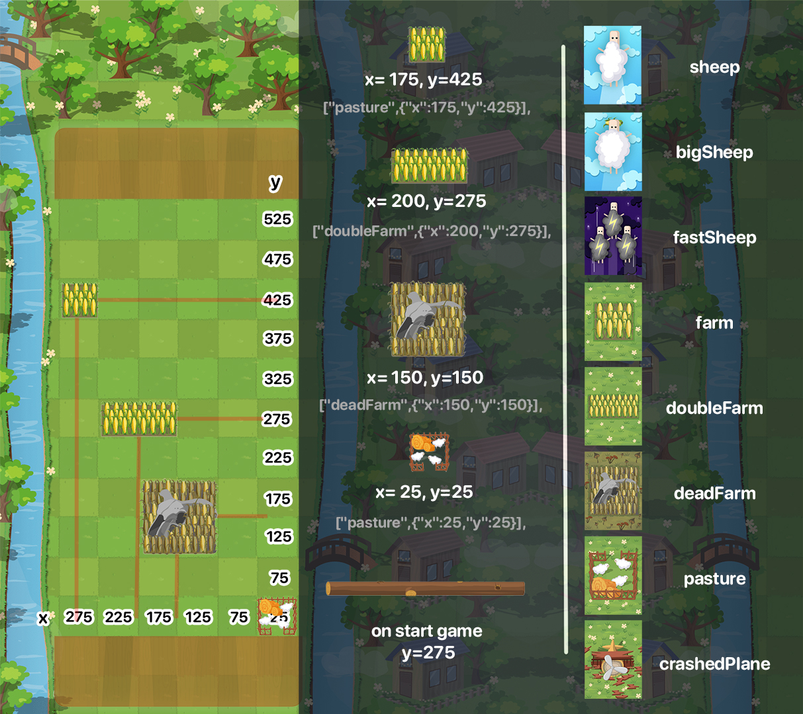

### Бот для Sheep Royale 2 | vk.com/app51491054

---
Может автоматически играть по вашим билдам, открывать сундуки и получать награды, поддерживает несколько аккаунтов.


Установка:
- `git clone https://github.com/asyven/sheep-royale-bot.git`
- `npm install`
- Переименовать `accounts.example.json` в `accounts.json` и добавить свой аккаунт.

Запуск с мануальным выбором режима:
`node index.js`

Запуск с рейтинговыми автоиграми:
`node index.js --mode="rating"`

Для каждого аккаунта можно настроить параметры файл `accounts.json`, `*` обязательные, без них не будет ничего работать.

| Параметр               | Инструкция (описание)                                                                    |
|------------------------|------------------------------------------------------------------------------------------|
| params *               | 1. Открываем [игру](https://vk.com/app51491054);                                         |
|                        | 2. Нажимаем `F12` (Для Chromium браузеров);                                              |
|                        | 3. Перезагружаем страницу горячей клавишей `F5`;                                         |
|                        | 4. В появившейся панели выбираем вкладку `Network`;                                      |
|                        | 5. Находим кнопку `Filter` (в виде воронки);                                             |
|                        | 6. В появившемся поле пишем `user/get`;                                                  |
|                        | 7. В панели появится поле `get`, нажимаем по нему;                                       |
|                        | 8. Появится ещё одна панель, выбираем в ней вкладку `Headers`;                           |
|                        | 9. Ищем поле `Authorization` в request headers;                                          |
|                        | 10. Копируем его значение (начинается c `vk_access_token_settings`);                     |
|                        | 11. Вставляем скопированный текст в значение `params` в `accounts.json` между кавычками. |
| id *                   | id добавляемого аккаунта, можно взять с `params`, айди будет после `vk_user_id=`;        |
| build                  | Устанавливаем билд, по которому будет играть аккаунт,                                    |
|                        | его порядковый номер (считать с 0), если не указан, то будет стандартный.                |
| config.showProfileInfo | Будет отображать информацию об аккаунте. `true или false`                                |
| config.unlockChest     | Будет использовать сундук (начнется наймер открытия) `true или false`                    |
| config.watchChestAd    | Будет смотреть рекламу для уменьшения времени открытия  `true или false`                 |
| config.openChest       | Будет открывать сундук если это возможно `true или false`                                |
| config.showGame        | Будет показывать игру в консоли в режиме реального времени `true или false`              |
| config.loopGame        | Будет запускать бесконечно новые игры после завершения  `true или false`                 |
| config.proxy           | Можете указать прокси, чтобы уменьшить вероятность бана, подходят любые `https`          |


Настройка своих билдов.

Пример стандартного билда:
```json
{
"cards": ["sheep", "bigSheep", "pasture", "farm"],

    "structure": [
      ["farm",{"x":25,"y":25}],
      ["farm",{"x":75,"y":25}],
      ["farm",{"x":125,"y":25}],
      ["farm",{"x":175,"y":25}],
      ["farm",{"x":225,"y":25}],
      ["farm",{"x":275,"y":25}],
      
      ["pasture",{"x":25,"y":75}],
      ["farm",{"x":75,"y":75}],
      ["farm",{"x":125,"y":75}],
      ["farm",{"x":175,"y":75}],
      ["farm",{"x":225,"y":75}],
      ["farm",{"x":275,"y":75}],
      
      ["pasture",{"x":25,"y":125}],
      ["pasture",{"x":75,"y":125}],
      ["farm",{"x":125,"y":125}],
      ["farm",{"x":175,"y":125}],
      ["farm",{"x":225,"y":125}],
      ["farm",{"x":275,"y":125}],
      
      ["pasture",{"x":25,"y":175}],
      ["pasture",{"x":75,"y":175}],
      ["pasture",{"x":125,"y":175}],
      ["farm",{"x":175,"y":175}],
      ["farm",{"x":225,"y":175}],
      ["farm",{"x":275,"y":175}],
      
      ["pasture",{"x":25,"y":225}],
      ["pasture",{"x":75,"y":225}],
      ["pasture",{"x":125,"y":225}],
      ["pasture",{"x":175,"y":225}],
      ["farm",{"x":225,"y":225}],
      ["farm",{"x":275,"y":225}],
      
      ["pasture",{"x":25,"y":275}],
      ["pasture",{"x":75,"y":275}],
      ["pasture",{"x":125,"y":275}],
      ["pasture",{"x":175,"y":275}],
      ["pasture",{"x":225,"y":275}],
      ["farm",{"x":275,"y":275}]
    ],

    "def": {
      "threshold": 250,
      "minThreshold": 125,
      "units": ["bigSheep"]
    },

    "push": {
      "threshold": 275,
      "minThreshold": 101,
      "units": ["bigSheep"]
    }
}
```

Сделан за вечер, возможность бана - **огромная**.

Если будут вопросы - найти меня можете тут: `vk.com/asyven` или создавайте issue